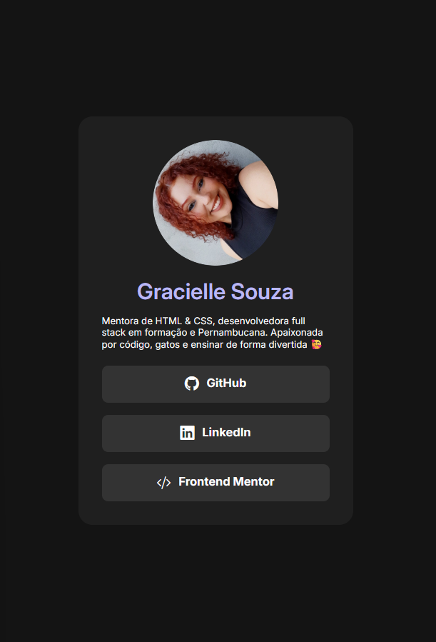

# 🌐 My Links | Gracielle Souza

Uma página de links personalizada desenvolvida para reunir meus principais perfis profissionais e de estudo.
O projeto foi inspirado no desafio [**Social Links Profile**](https://www.frontendmentor.io/challenges/social-links-profile-UG32l9m6dQ) do Frontend Mentor, mas ganhou minha própria identidade visual, com novas cores, gradientes e um toque de JavaScript para tornar a interação mais fluida, principalmente em dispositivos mobile.

---

### 🚀 Objetivo do projeto

Criar uma página simples, moderna e responsiva para centralizar meus links (GitHub, LinkedIn e Frontend Mentor), servindo como um mini portfólio interativo e visualmente agradável.

---

### 🛠️ Tecnologias utilizadas

* **HTML5** – estrutura semântica e acessível
* **CSS3** – layout responsivo e efeitos de gradiente
* **JavaScript** – simulação de hover em dispositivos touch
* **Bootstrap Icons** – ícones leves e práticos
* **Google Fonts (Inter)** – tipografia limpa e moderna

---

### 💻 Preview

📸 **Veja o projeto em ação:**
👉 [**My Links - Gracielle Souza**](https://glssv.github.io/my-space/)

---

### ✨ Sobre o projeto

Esse projeto é um dos meus favoritos porque combina **simplicidade e estilo** — uma base sólida em HTML e CSS com um toque de JavaScript para melhorar a experiência.
Foi uma ótima oportunidade para praticar responsividade, transições suaves e personalização de interface.

----

  
  
Desenvolvido com 💜
 

